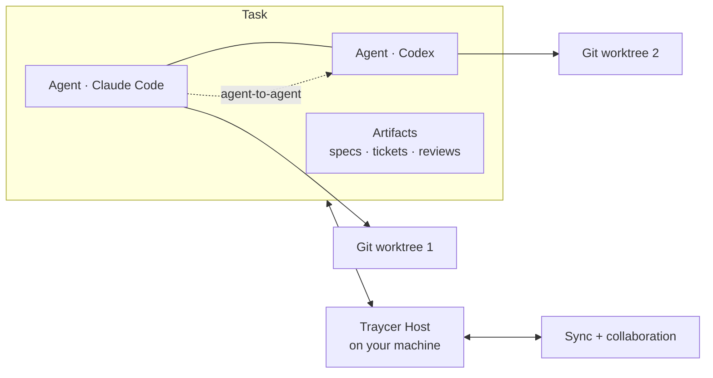

[Download](https://traycer.ai/download) · [Docs](https://docs.traycer.ai) · [Releases](https://github.com/traycerai/traycer/releases/latest) · [Contributing](CONTRIBUTING.md)

 

**Run a fleet of coding agents — Claude Code, Codex, Cursor, and a dozen more — in parallel, on your existing subscriptions, without losing context.**

Traycer is an open-source AI orchestration app. Every agent keeps a durable session you can hand between models mid-conversation, agents talk to each other to plan, implement, and review, and your whole team can work in the same shared workspace in real time.

## Features

|  |  |
| --- | --- |
| **Parallel agents, isolated worktrees** — Spin up any number of agents in one Task. Each can run in its own Git worktree, so parallel work never collides. | <!-- assets/parallel-agents.gif --> <i>demo coming soon</i> |
| **Switch models mid-conversation** — Move the same agent between Claude, Codex, Grok, or any other provider without losing a word of context. The context window is shared across all providers. | <!-- assets/model-switch.gif --> <i>demo coming soon</i> |
| **Agent-to-agent communication** — Agents message each other to delegate tickets, debate architecture, and peer-review code. Capabilities are permissioned per user, Host, and runtime — see the [capability matrix](https://docs.traycer.ai/concepts/agent-to-agent). | <!-- assets/agent-to-agent.gif --> <i>demo coming soon</i> |
| **Artifacts that outlive the chat** — Specs, tickets, reviews, and walkthroughs live as rendered documents beside the conversation — with live wireframe and Mermaid previews — so intent and decisions survive long after the transcript scrolls away. | <!-- assets/artifacts.gif --> <i>demo coming soon</i> |
| **Real-time team collaboration** — Invite teammates into a shared workspace: shareable boards, live co-editing, comments, and ticket assignment. | <!-- assets/collaboration.gif --> <i>demo coming soon</i> |
| **Chat and Terminal, side by side** — Work with the same providers through a rich Chat interface or a real Terminal, with files and Git diff panels one keystroke away. | <!-- assets/terminal-and-diff.gif --> <i>demo coming soon</i> |
| **Cross-device sync** — Close your laptop, open another machine, and pick up the same agents in the same state. Any device, any OS. | <!-- assets/cross-device.gif --> <i>demo coming soon</i> |
| **Remote hosts** — Every machine you sign in on runs a Traycer Host, and the app can reach all of yours. Kick off agents on your desktop or a beefy remote box, then steer them from wherever you are. | <!-- assets/remote-hosts.gif --> <i>demo coming soon</i> |
| **Mobile app** *coming soon* — Watch runs, answer your agents' questions, and start new work from your phone. iOS and Android. | <!-- assets/mobile.gif --> <i>demo coming soon</i> |
| **In-app browser** *coming soon* — A browser built into Traycer that agents can drive: open the app they just built, click through flows, and debug live pages without leaving the workspace. | <!-- assets/in-app-browser.gif --> <i>demo coming soon</i> |

## Bring Your Own Agent

Traycer connects to the subscriptions you already pay for instead of locking you into one ecosystem — or use Traycer's native inference subscription. Connect any of these coding agents:

<table>
  <tr>
    <td align="center" width="150"><a href="https://claude.com/product/claude-code"> <b>Claude Code</b></a></td>
    <td align="center" width="150"><a href="https://openai.com/codex"> <b>Codex</b></a></td>
    <td align="center" width="150"><a href="https://cursor.com"> <b>Cursor</b></a></td>
    <td align="center" width="150"><a href="https://opencode.ai"> <b>OpenCode</b></a></td>
  </tr>
  <tr>
    <td align="center" width="150"><a href="https://traycer.ai"> <b>Traycer</b></a></td>
    <td align="center" width="150"><a href="https://x.ai"> <b>Grok</b></a></td>
    <td align="center" width="150"><a href="https://github.com/features/copilot"> <b>GitHub Copilot</b></a></td>
    <td align="center" width="150"><a href="https://devin.ai"> <b>Devin</b></a></td>
  </tr>
  <tr>
    <td align="center" width="150"><a href="https://ampcode.com"> <b>Amp</b></a></td>
    <td align="center" width="150"><a href="https://factory.ai"> <b>Droid</b></a></td>
    <td align="center" width="150"><a href="https://kiro.dev"> <b>Kiro</b></a></td>
    <td align="center" width="150"><a href="https://kilocode.ai"> <b>Kilo Code</b></a></td>
  </tr>
  <tr>
    <td align="center" width="150"><a href="https://kimi.com"> <b>Kimi</b></a></td>
    <td align="center" width="150"><a href="https://github.com/QwenLM/qwen-code"> <b>Qwen Code</b></a></td>
    <td align="center" width="150"><a href="https://openrouter.ai"> <b>OpenRouter</b></a></td>
    <td align="center" width="150"><a href="https://pi.dev"> <b>Pi</b></a></td>
  </tr>
  <tr>
    <td align="center" width="150"><a href="https://hermes-agent.nousresearch.com"> <b>Hermes Agent</b></a></td>
    <td align="center" width="150"><a href="https://huggingface.co"> <b>Hugging Face</b></a></td>
    <td align="center" width="150"><a href="https://github.com/can1357/oh-my-pi"> <b>Oh My Pi</b></a></td>
    <td align="center" width="150"><a href="https://reasonix.io"> <b>Reasonix</b></a></td>
  </tr>
</table>

Setup commands and provider-specific configuration: [Coding Agents docs](https://docs.traycer.ai/agents-and-models/coding-agents).

## How it works

- **Task** — the top-level container for related agents, panels, terminals, and artifacts.
- **Agent** — a durable session; switch its model anytime, delegate to child agents, reach it from any device.
- **Artifacts** — persistent documents (specs, tickets, stories, reviews) that keep decisions and context beyond the conversation.
- **Worktrees** — run each agent in your workspace folder, a fresh Git worktree, or an existing one.
- **Hosts** — each machine you sign in on runs a Traycer Host that owns its agents and files; every client can reach any of your hosts, local or remote.

This repository contains the open-source clients, CLI, and protocol. The Traycer Host is provisioned as a signed build from GitHub Releases — see [docs/DEVELOPMENT.md](docs/DEVELOPMENT.md).

## Installation

| Platform              | Install                                                                                                                   |
| --------------------- | ------------------------------------------------------------------------------------------------------------------------- |
| macOS (Apple Silicon) | [Download .dmg (arm64)](https://github.com/traycerai/traycer/releases/latest/download/traycer-desktop-macos-arm64.dmg)    |
| macOS (Intel)         | [Download .dmg (x64)](https://github.com/traycerai/traycer/releases/latest/download/traycer-desktop-macos-x64.dmg)        |
| Linux (AppImage)      | [Download .AppImage](https://github.com/traycerai/traycer/releases/latest/download/traycer-desktop-linux-x86_64.AppImage) |
| Linux (Debian/Ubuntu) | [Download .deb](https://github.com/traycerai/traycer/releases/latest/download/traycer-desktop-linux-amd64.deb)            |
| Linux (Fedora/RHEL)   | [Download .rpm](https://github.com/traycerai/traycer/releases/latest/download/traycer-desktop-linux-x86_64.rpm)           |
| Windows (x64)         | [Download .exe](https://github.com/traycerai/traycer/releases/latest/download/traycer-desktop-windows-x64.exe)            |

All builds: [latest release](https://github.com/traycerai/traycer/releases/latest). Mobile apps for iOS and Android are coming soon.

## Privacy

Your code is processed in-memory and never stored or used for training. Prompts and conversations follow **Privacy Mode** (default on for Team plans, opt-in for individuals); with it off, prompts may be logged to help improve our Services.

Agent requests for the CLI providers you configure go directly to that provider; Traycer's own inference is served by Traycer. Crash reporting (Sentry) and analytics (PostHog) may be enabled in release builds. Full [Privacy Policy](https://traycer.ai/legal/privacy-policy).

## Documentation

Setup, configuration, agent integrations, and provider-specific behavior: [**docs.traycer.ai**](https://docs.traycer.ai).

## Contributing

We welcome contributions! See [CONTRIBUTING.md](CONTRIBUTING.md) and our [Code of Conduct](CODE_OF_CONDUCT.md). Commits must be signed off under the [Developer Certificate of Origin (DCO)](CONTRIBUTING.md#developer-certificate-of-origin-dco). Bugs and feature requests: [open an issue](https://github.com/traycerai/traycer/issues).

> **Security:** Please don't report security vulnerabilities through public GitHub issues — email **support@traycer.ai**. See the [Security Policy](SECURITY.md).

## Community

- **[Discord](https://traycer.ai/discord)** — chat with the team and community
- **[X / Twitter](https://x.com/traycerai)** — updates and announcements
- **[YouTube](https://www.youtube.com/@TraycerAI)** — walkthroughs and demos

## Star History

## License

Licensed under the [MIT License](LICENSE).
