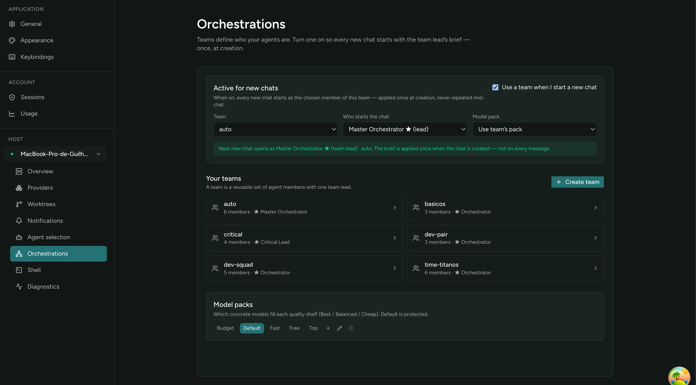
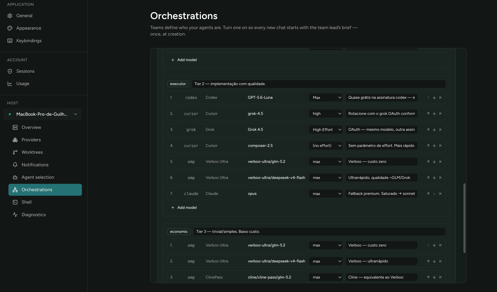
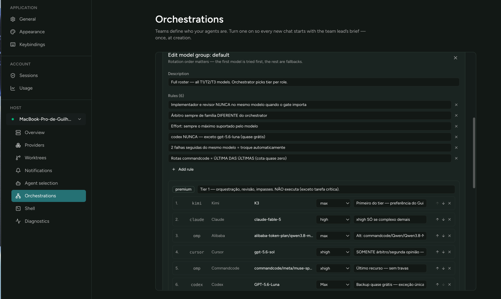

# Thanos Traycer

**Thanos Traycer** is a personal **test fork** of
[Traycer](https://github.com/traycerai/traycer) — a sandbox where
[@gavasques](https://github.com/gavasques) experiments with product ideas
before proposing them to the official Traycer. It is not a product and not a
rival fork: experiments that work are meant to be upstreamed (see
[traycerai/traycer#1112](https://github.com/traycerai/traycer/issues/1112) and
[#1113](https://github.com/traycerai/traycer/issues/1113)).

It keeps the original Traycer base — desktop shell, host lifecycle, CLI, BYOA
agent integrations, and agent-to-agent communication — and adds experimental
local layers for multi-project work and team templates.

## What this fork adds (experiments)

- **Multi Profile** — isolate projects/workspaces so tabs, drafts, and context
  stay on the active profile (no cross-project leakage).
- **Orchestrations** — agent team templates with roles, responsibilities, model
  tiers (`premium` / `executor` / `economic`), model groups, and optional
  create-time inject of role context into new chats.
- **Local single-user posture** — optional kill of official auto-update feed so
  a personal build is not overwritten by upstream packaging defaults.

### Screenshots

Orchestrations home: teams, the active-for-new-chats binding, and model packs.



Model pack editor: rotation-ordered shelves per tier (first model tried first,
the rest are fallbacks), including cross-provider rotation.



Pack rules and the premium shelf (team-level guardrails travel with the pack).



## Upstream

Upstream project: [traycerai/traycer](https://github.com/traycerai/traycer)  
This fork: **[gavasques/thanos-traycer](https://github.com/gavasques/thanos-traycer)** (local product name: **Thanos Traycer**).

Sync policy here: merge `upstream/main` carefully — **never** `gh repo sync`
(force-overwrites custom history).

---

<details>
<summary>Upstream Traycer README (reference)</summary>


Traycer is an open-source AI orchestration app for advanced agent orchestration.
Bring your existing provider subscriptions and run multiple agents in parallel
without losing context, using shared memory across all models and providers.

### Upstream features (still in the base)

- **Bring Your Own Agent (BYOA)**
- **Unified Context** across providers
- **Agent-to-Agent Communication**
- **Collaboration** boards / sharing (upstream; this fork may hide or bypass
  parts for single-user use)
- **Cross-Device Sync** (upstream cloud)

Docs: https://docs.traycer.ai  
Upstream releases: https://github.com/traycerai/traycer/releases

</details>

## Development

See [docs/DEVELOPMENT.md](./docs/DEVELOPMENT.md) and root `AGENTS.md`.

```bash
# Desktop (Thanos slot, keep host warm)
make dev-desktop ARGS="--slot thanos --keep-host"
```

## License

Same as upstream (MIT) — see [LICENSE](./LICENSE).
