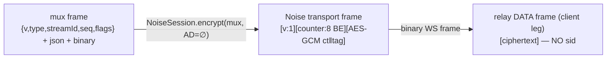
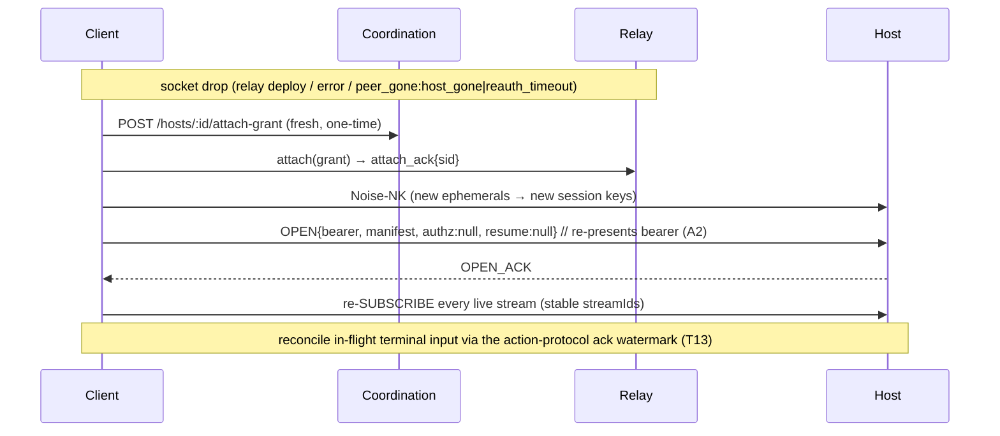

# Client↔host remote transport — mux wire contract (T12)

The client remote transport (`clients/shared/host-transport/remote/`) speaks a
persistent, end-to-end-encrypted, multiplexed session to the host through the
relay. **This document is the source of truth the T11 host responder builds to**
— it mirrors how `workers/relay-do/README.md` documents the relay leg. The
machine-checkable form of everything here lives in `remote/protocol.ts`.

Governs Architecture **§3** (mux/transport), **§9** (client rows). Carries
**R4-E3** (defer resume tickets), **R4-A2** (bridging-never-identity), **R4-D1**
(reserved authz slot), **R4-D2** (peer-enforce host standing).

> Status: client transport implemented in T12. The host responder (T11) is
> dispatched after this and MUST match the framing below. Points still to
> reconcile at integration are called out inline as **⚠️ reconcile**.

## 1. Three concentric framings

Only the outermost is relay-visible. Everything below the Noise layer is
ciphertext to the relay.



| Layer                      | Owner                            | Bytes on the client leg                                                        | Who sees it   |
| -------------------------- | -------------------------------- | ------------------------------------------------------------------------------ | ------------- |
| Relay frame (T10)          | relay                            | `[ciphertext]` (binary WS) — **no `sid`**; the relay knows this socket's `sid` | relay + peers |
| Noise transport frame (T8) | `@traycer/protocol/crypto/noise` | `[v:1][counter:8 BE][AES-GCM ct‖tag]`                                          | peers only    |
| Mux frame (T12, this doc)  | client + host                    | `{v,type,streamId,seq,flags}` + `[jsonLen][json][binary]`                      | peers only    |

The architecture's `{v, sid, streamId, seq}` conflates layers 1 and 3: **`sid`
lives at the relay frame layer** (host-leg `[sid]` prefix — see relay README),
**`{v, streamId, seq}` at the mux layer**. The client omits `sid` on-wire
because its single socket is its single session. The host learns each frame's
`sid` from its relay uplink (`[sid][ciphertext]`), demultiplexes to that client's
Noise session, then reads the mux `streamId` inside.

**Associated data is empty (∅) on both legs.** The relay owns/stamps `sid`, so
there is no outer routing metadata to bind; the Noise monotonic counter + replay
window already defeat replay. T11's responder MUST call `encrypt`/`decrypt` with
an empty AD.

## 2. Noise-NK handshake

Suite `Noise_NK_25519_AESGCM_SHA256` (T8). The client is the **initiator**
(anonymous at the Noise layer); the host is the **responder**, authenticated by
its registry-published static X25519 key.

- **Prologue** (mixed into both sides' handshake hash, MUST match byte-for-byte):
  `NOISE_PROLOGUE = utf8("traycer-remote-host/mux/v1")`.
- **Host static key**: the client reads it from the `GET /hosts` DTO
  `publicKey` field and decodes hex **or** base64/base64url to 32 bytes
  (`decodeHostPublicKey`). **⚠️ reconcile** the exact publish encoding with
  T3/T5.
- **Messages** (2, carried as opaque relay DATA binary frames):
  1. client → host `msg0` (`e, es`)
  2. host → client `msg1` (`e, ee`)
- After `msg1`, both derive `NoiseSession` (`fromHandshake`, replay window
  `DEFAULT_REPLAY_WINDOW_SIZE`). All subsequent DATA frames are Noise transport
  frames wrapping mux frames.

A **fresh Noise session is built per session, including per resume** — forward
secrecy per session.

## 3. Mux frame binary layout

Fixed 15-byte header, big-endian:

```
[0]      v         uint8    mux protocol version (=1)
[1]      type      uint8    MuxFrameType
[2..6)   streamId  uint32   0 = session control; ≥1 = logical stream
[6..10)  seq       uint32   per-stream monotonic (FIFO / reconcile watermark)
[10]     flags     uint8    bit0 HAS_BINARY · bit1 BULK · bit2 CHUNKED · bit3 CHUNK_LAST
[11..15) jsonLen   uint32
[15..15+jsonLen)   json     utf8 (0-length on a pure continuation chunk)
[15+jsonLen..)     binary   the paired payload / chunk slice
```

### Frame types (`type`)

| Value | Name                | streamId | Payload (json)                                                |
| ----- | ------------------- | -------- | ------------------------------------------------------------- |
| 1     | `OPEN`              | 0        | `{muxVersion, bearer, manifest, authz, resume}`               |
| 2     | `OPEN_ACK`          | 0        | `{manifest, capabilities}`                                    |
| 3     | `REQUEST`           | ≥1       | `{requestId, method, schemaVersion, params, idempotencyKey}`  |
| 4     | `RESPONSE`          | ≥1       | `{requestId, method, result, error}`                          |
| 5     | `SUBSCRIBE`         | ≥1       | `{method, schemaVersion, params}`                             |
| 6     | `STREAM_FRAME`      | ≥1       | the stream envelope `{kind, hasBinaryPayload, …}` + binary    |
| 7     | `CLOSE`             | ≥1       | `{reason}`                                                    |
| 8     | `FATAL`             | 0 or ≥1  | `{details}` (`FatalErrorDetails`; streamId 0 = whole session) |
| 9     | `CREDIT`            | 0        | `{credits}` (bulk send-window replenish)                      |
| 10    | `REAUTH_NOTICE`     | 0        | `{standingUntil}` — host-standing evidence (R4-D2)            |
| 11    | `RESUME`            | 0        | **RESERVED** (R4-E3 resume ticket) — not sent in v1           |
| 12    | `CREDENTIAL_UPDATE` | 0        | `{bearer}` — in-place bearer rotation (capability-gated)      |

`streamId` allocation: the client allocates monotonically from 1. A **subscribe
streamId is stable for the subscription's life across resumes**; a **unary
streamId is ephemeral** (freed when its `RESPONSE` arrives). On resume the client
re-sends `SUBSCRIBE` on the same streamId, so the host re-learns
`streamId → subscription` from the frames.

## 4. Session open / ack (identity, R4-A2 / R4-D1)

`OPEN` (streamId 0) is sent immediately after the Noise handshake **and again on
every resume**:

```jsonc
{
  "muxVersion": 1,
  "bearer": "<user JWS>",          // R4-A2: re-presented on attach AND resume
  "manifest": { "rpc": { …ConnectionManifest… }, "stream": { …ConnectionManifest… } },
  "authz": null,                    // R4-D1 RESERVED: versioned session-grant slot (team hosts, v3)
  "resume": null                    // R4-E3 RESERVED: always null (v1 = fresh full attach)
}
```

- **Bridging-never-identity (R4-A2).** The attach grant authorizes relay
  _bridging_ only. A fresh Noise session is **not** an authenticated session
  until `OPEN` re-presents the `bearer`. The host MUST verify the bearer
  (JWKS + `token.id == ownerUserId`) on **every** `OPEN`, attach and resume
  alike — a grant/ticket MUST NEVER restore identity.
- **Reserved authz slot (R4-D1).** `authz` is always `null` in v1. The host MUST
  accept `null` and ignore any populated slot. It exists so a future
  `session-grant` (own `typ`/`aud`/signing key) enables team hosts without a
  breaking `OPEN` change.
- **Reserved resume descriptor (R4-E3).** `resume` is always `null`. v1 resume is
  a fresh full attach (new grant + new Noise + fresh `OPEN`).

`OPEN_ACK` (streamId 0):

```jsonc
{
  "manifest": { "rpc": …, "stream": … },      // host's combined manifests
  "capabilities": ["credentialUpdate"]         // additive; e.g. in-place bearer rotation
}
```

Version negotiation is amortized: the client runs `checkCompatibility` (rpc) at
`OPEN_ACK`, then per-stream `checkStreamMethodCompatibility` at each subscribe,
reusing the exact framework helpers the local transports use. A hard
incompatibility → session `FATAL{code:"INCOMPATIBLE"}`.

## 5. Unary RPC (single-flight, no post-send auto-retry — audit C3)

- One `REQUEST` per call on a fresh streamId; the matching `RESPONSE` (correlated
  by `requestId`) resolves it. `idempotencyKey` is **always null in v1** (reserved
  for later per-method opt-in dedup — no host dedup machinery yet).
- The client rejects with a **retryable** transport error only when the session
  is not yet ready (provably pre-send); once the `REQUEST` is enqueued, any drop
  surfaces as a plain non-retryable error. Exact local parity — the host needs no
  retry/dedup handling.

## 6. Streams

- `SUBSCRIBE` opens a logical stream; inbound `STREAM_FRAME`s carry the contract
  envelope as json and its payload as the frame binary (adjacency preserved
  inside one frame). Outbound frames while the session is not ready are dropped
  (fire-and-forget parity; the durable channel / CRDT reconciles above).
- **Shared fate:** one transport drop reconnects ALL streams. The client re-sends
  every live `SUBSCRIBE` after `OPEN_ACK` on resume.

## 7. QoS classes, priority scheduling, credits (audit C1/C2)

Two classes, **fixed per stream at creation** (preserves per-stream FIFO — a
stream never splits across the two queues):

| Class             | Frames                                                                  | Scheduling                   | Credit-gated?           | Chunked?                                                 |
| ----------------- | ----------------------------------------------------------------------- | ---------------------------- | ----------------------- | -------------------------------------------------------- |
| `INTERACTIVE` (0) | keystrokes, live output, all control/unary, subscribe streams (default) | preempts bulk; drained first | **no** (must not stall) | large binary still split at 64 KiB, but stays this class |
| `BULK` (1)        | large order-independent transfers (opt-in stream class)                 | yields to interactive        | **yes**                 | yes                                                      |

- **Priority scheduler:** interactive queue is fully drained before the next
  bulk frame; the interactive queue is re-checked between every bulk frame, so a
  keystroke preempts the next bulk chunk — a keystroke never queues behind a
  megabyte frame.
- **Credits:** both peers start with `INITIAL_BULK_SEND_CREDITS` (512) bulk
  **send** credits; each bulk frame (each chunk) consumes one. As a peer consumes
  inbound bulk frames it grants a fresh batch back via `CREDIT` (streamId 0)
  every `INBOUND_CREDIT_GRANT_BATCH` (256) frames. **⚠️ reconcile:** the host's
  initial receive window MUST be ≥ 512 and it MUST honor client `CREDIT` grants /
  send its own.

## 8. 64 KiB bulk chunking

`STREAM_FRAME` / `RESPONSE` whose binary exceeds `BULK_CHUNK_SIZE_BYTES` (64 KiB)
is split: every chunk sets `CHUNKED`, only the final sets `CHUNK_LAST`; the json
envelope rides the **first** chunk only, continuation chunks carry empty json.
Per-stream FIFO keeps a message's chunks contiguous, so the receiver reassembles
by accumulating a stream's chunk binaries until `CHUNK_LAST` (`ChunkReassembler`).
Control/session frames are never chunked.

## 9. Full-attach resume (R4-E3 — the primary recovery path)

A relay deploy drops every socket by documented Cloudflare behavior — treat it as
routine. **v1 resume = a fresh full attach**, not a ticket:



- **Backoff resets ONLY at the ready boundary** (transport open · E2E handshake ·
  session open · subscriptions restored), never on socket-open.
- In-flight unary calls are rejected non-retryably on drop (post-send from the
  caller's view — the host may have applied them).
- **Reconcile** of in-flight terminal input rides the terminal action protocol's
  ack watermark — that is **T13**; the mux only guarantees per-stream FIFO +
  re-subscribe and reserves `seq` for the watermark.

### Host blip is NOT a resume

`host_detached` (relay control) → the client **pauses** the scheduler (holding
frames, not losing them to a host-less relay) and marks streams reconnecting;
`host_attached` → resume on the **same** Noise session (no re-handshake). Only a
socket drop or `peer_gone`/`killed` triggers a full attach. `peer_gone`/`killed`
reasons `revoked` / `policy_violation` are **terminal**; `host_gone` /
`reauth_timeout` → full-resume with backoff.

## 10. Re-auth & peer-enforced host standing (R4-D2)

- **Client leg (≤60 min):** the client re-mints a fresh one-time attach grant and
  re-presents it in-band via the relay `reauth{grant}` control frame at
  ~45 min ± jitter, under the relay's 60-min client-leg deadline.
- **Host leg (≤15 min), peer-enforced:** a revoked host will not enforce its own
  death, so the client runs a 15-min **host-standing watchdog**, reset by any
  evidence the host is alive + bridging: any inbound frame, a relay
  `host_attached`, or a `REAUTH_NOTICE` mux frame. On lapse the client fails the
  session itself. **⚠️ reconcile:** T11 SHOULD emit `REAUTH_NOTICE{standingUntil}`
  after each successful relay re-auth so the client has an explicit host-standing
  signal (the future P2P swap turns this into a CS-signed assertion); absent it,
  the client falls back to `host_attached` / inbound-frame liveness.

## 11. Keepalive

Relay `relay-ping` / `relay-pong` strings only (auto-responded by the relay
without waking the DO). **No E2E idle ping** (R4-C1) — the idle liveness floor is
the re-auth exchange. The client sends `relay-ping` on an interval and drops the
socket on missed pongs.

## 12. Reserved / deferred (do not build in v1, keep additive)

| Field / type                        | Reserve  | Why                                                      |
| ----------------------------------- | -------- | -------------------------------------------------------- |
| `OPEN.authz`                        | R4-D1    | versioned session-grant slot for team hosts (v3)         |
| `OPEN.resume` + `RESUME` frame type | R4-E3    | resume-ticket fast-follow; v1 is fresh full attach       |
| `REQUEST.idempotencyKey`            | audit C3 | later per-method opt-in dedup                            |
| `CREDENTIAL_UPDATE` capability      | —        | in-place bearer rotation; capability-gated on `OPEN_ACK` |
