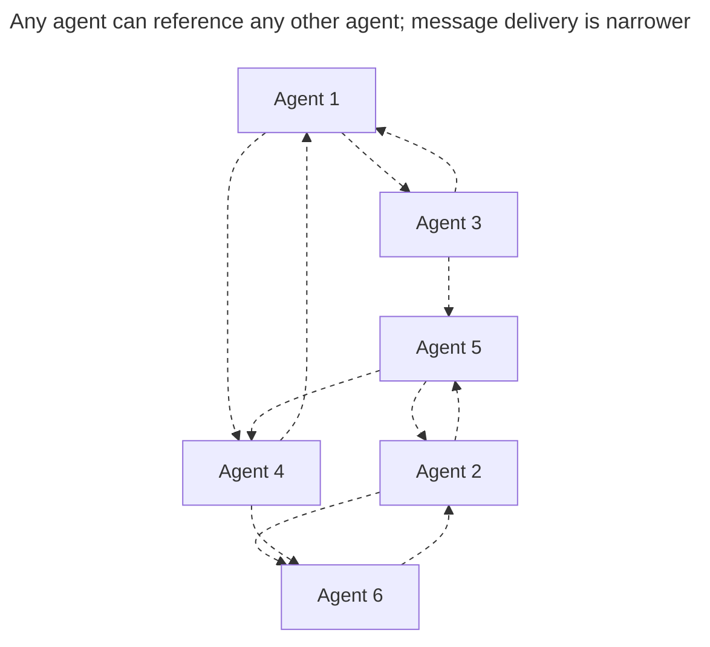

Agent-to-agent communication lets Traycer agents coordinate with each other inside the same Task.

Use it when running agents need to split work, ask another agent to investigate something, get a review, or share results without losing the larger Task context.

## What It Does

An agent can:

- create a child agent
- send another agent instructions
- ask for a reply or send a fire-and-forget message
- read another agent's transcript
- coordinate from the agent session it is running in

The result is still visible in the Task. Child agents appear in the [Agents](/panels/agents) tree under the agent that created them, so the lineage is not hidden.

```text
Agent: plan the implementation           (Chat)
├─ Agent: review the database changes    (Chat)
├─ Agent: inspect failing tests          (Terminal)
│  └─ Agent: summarize the failure cause (Chat)
├─ Agent: update the docs plan           (Chat)
└─ Agent: verify the final changes       (Terminal)
```

The tree shows where each agent came from. It does not restrict which agents you can reference: referencing is not limited to a parent or a child.



Dashed edges are **references**, which are always available inside a Task. Whether a message can actually be *delivered* along one of those edges depends on the capability gates below.

## Lineage And Sessions

The agent that starts another agent is the **parent**. The new agent is the **child**.

The child agent has its own session, model, transcript, and run state. It does not merge into the parent agent. The parent can read the result, continue the conversation, or use the child agent's work as context for the next step.

This is why agent-to-agent work shows up as hierarchy in the Agents panel instead of as one flat transcript. Hierarchy is provenance only: any agent can reference any other agent in the Task, not just its own parent or children.

<video className="w-full aspect-video rounded-xl" controls autoPlay loop muted playsInline aria-label="Open a child agent and its delegated brief">
  <source src="https://assets.traycer.ai/docs/videos/agents-hierarchy.mp4" type="video/mp4" />
  Unable to load video.
</video>

## Agent Selection

Traycer uses agent-selection instructions to choose the right coding agent, model, and reasoning effort for delegated work. Configure the global defaults in [Settings > Agent selection](/settings/agents). A workspace can refine them with `.traycer/agent-selection-guide.md`.

## Three Separate Capabilities

Referencing an agent, reading its transcript, and sending it a message are **different capabilities** with **different requirements**. An agent can be fully referenceable while its transcript is unreadable from where you are, and while it cannot receive a message at all. Those are normal states, not errors.

| Capability | What it requires |
|---|---|
| **Reference** | Nothing beyond being a supported agent in the Task. Always available, either interface. |
| **Transcript** | Same user. A **Chat**-interface agent's history is Task-backed, so it reads across Hosts. A **Terminal**-interface agent's transcript must be read on the Host that owns it. |
| **Receive messages** | Same user; sender **and** receiver both local to the same Host; and both runtimes support agent-to-agent messaging. |

Referencing is the broad capability. Transcript access is narrower, and delivery is narrowest.

## Agent-To-Agent Support

This table shows what each coding agent's **runtime** allows. The user and Host requirements above still apply on top of it.

| Coding agent | Chat interface | Terminal interface |
|---|---|---|
| **Claude Code** | Reference, transcript, messages | Reference, transcript, messages |
| **Codex** | Reference, transcript, messages | Reference and transcript only |
| **OpenCode** | Reference, transcript, messages | Reference and transcript only |
| **Cursor** | Reference, transcript, messages | Not available |
| Every other coding agent | Reference, transcript, messages | Not available |

Read this by interface, not by product:

- On the **Chat** interface, every coding agent's runtime allows all three. Chat history is Task-backed, so a peer on another Host can still read it.
- On the **Terminal** interface, only **Claude Code** has an inbox for agent-to-agent messages. **Codex** and **OpenCode** Terminal-interface agents remain referenceable and their transcripts remain readable *from the Host that owns them* — they simply have nowhere to deliver a message.
- **Cursor** is Chat-interface only today, so it has no Terminal-interface row to support. See [Agents & Models](/agents-and-models/coding-agents) for which coding agents can back the Terminal interface at all.

<Warning>
  Runtime support is necessary but not sufficient. Traycer also requires:

  - **Transcript** — the same user. A Terminal-interface transcript additionally
    has to be read on the Host that owns that agent.
  - **Delivery** — the same user, *both* the sending and receiving agent local
    to the same Host, and an A2A-capable runtime on both ends.

  A Claude Code agent on another device is referenceable, but a message to it is
  rejected rather than queued, and its Terminal transcript cannot be read from
  here. See [Hosts](/concepts/hosts).
</Warning>

## Durability Is Not Availability

Closing a Terminal surface does **not** erase the agent's history. Traycer reads a Terminal-interface transcript from the coding agent's own session history rather than from terminal scrollback, so the record survives the terminal — and the app — closing.

That is durability, not universal readability. Reading it still requires the owning Host to be reachable and the coding agent's own session history to still be present. If either is missing, the transcript read fails rather than returning a partial or empty result.

Plain [Terminals](/panels/terminals) do not participate in any of the three. They are shell sessions, not agents.

For the broader distinction, see [Terminal Agents VS Terminals](/concepts/terminal-agents-vs-terminals).

## Related Pages

- [Agents](/panels/agents) explains where parent and child agents appear.
- [Agents & Models](/agents-and-models/coding-agents) lists supported coding-agent paths.
- [Settings > Agent selection](/settings/agents) explains global and workspace-specific agent-selection instructions.
