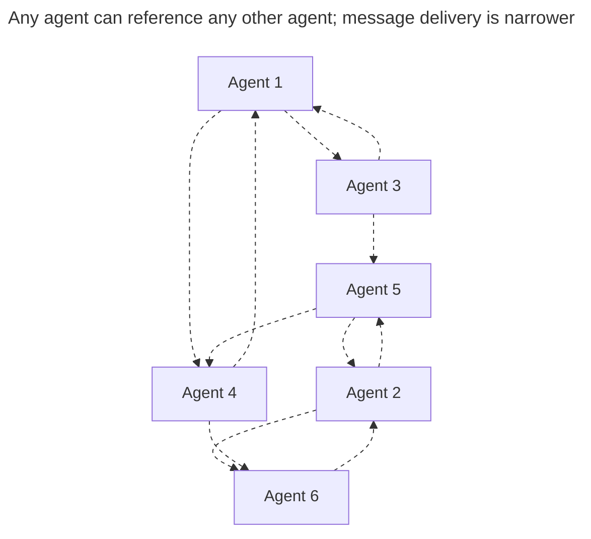

import { FeatureVideo } from "/snippets/feature-video.jsx";

Agent-to-agent communication lets Traycer agents coordinate with each other. Agents can reach your other agents in the same Task, in your other Tasks, and on your other hosts.

Use it when running agents need to split work, ask another agent to investigate something, get a review, or share results without losing the larger Task context.

This page is the reference for what agents can do to each other and when. Other pages link here rather than repeating the rules.

## What It Does

An agent can:

- create a child agent, in its own Task or another Task you can edit, on its own host or another of your hosts
- send another agent instructions, either asking for a reply or as a fire-and-forget message
- list agents and Tasks, and read another agent's transcript
- rename, stop, archive, fork, or reconfigure an agent
- claim a role, so other agents can see who owns what, when **Agent roles** is on in [General](/settings/general) settings

The result is still visible in the Task. Child agents appear in the [Agents](/panels/agents) tree under the agent that created them, so the lineage is not hidden. A child created in another Task appears at the top level of that Task's tree instead, so open that Task to find it. To see the messages themselves, open the [Agent office](#agent-office).

```text
Agent: plan the implementation           (Chat)
├─ Agent: review the database changes    (Chat)
├─ Agent: inspect failing tests          (Terminal)
│  └─ Agent: summarize the failure cause (Chat)
├─ Agent: update the docs plan           (Chat)
└─ Agent: verify the final changes       (Terminal)
```

The tree shows where each agent came from. It does not restrict which agents you can reference: referencing is not limited to a parent or a child.


```mermaid
---
title: Any agent can reference any other agent; message delivery is narrower
---
flowchart TD
  A[Agent 1]
  B[Agent 3]
  C[Agent 4]
  D[Agent 2]
  E[Agent 5]
  F[Agent 6]

  A -.-> B
  A -.-> C
  B -.-> A
  C -.-> A

  D -.-> E
  D -.-> F
  E -.-> D
  F -.-> D

  B -.-> E
  C -.-> F
  E -.-> C

  linkStyle default stroke-dasharray: 4 4
```

Dashed edges are **references**, which are always available inside a Task. Whether a message can actually be *delivered* along one of those edges depends on the rules below.

## Lineage And Sessions

The agent that starts another agent is the **parent**. The new agent is the **child**.

The child agent has its own session, model, transcript, and run state. It does not merge into the parent agent. The parent can read the result, continue the conversation, or use the child agent's work as context for the next step.

This is why agent-to-agent work shows up as hierarchy in the Agents panel instead of as one flat transcript. Hierarchy is provenance only: any agent can reference any other agent in the Task, not just its own parent or children.

<FeatureVideo src="https://assets.traycer.ai/docs/videos/agents-hierarchy.mp4" label="Open a child agent and its delegated brief" />

## Agent Selection

Traycer uses agent-selection instructions to choose the right coding agent, model, and reasoning effort for delegated work. Configure the global defaults in [Settings > Agent selection](/settings/agents). A workspace can refine them with `.traycer/agent-selection-guide.md`.

## Three Separate Capabilities

Referencing an agent, reading its transcript, and sending it a message are **different capabilities** with **different requirements**. An agent can be fully referenceable while its transcript is unreadable from where you are, and while it cannot receive a message at all. Those are normal states, not errors.

| Capability           | What it requires                                                                                                                                        |
| -------------------- | ------------------------------------------------------------------------------------------------------------------------------------------------------- |
| **Reference**        | Nothing beyond being an agent in the Task. Always available, on either interface.                                                                       |
| **Transcript**       | Your own agent, on any of your hosts. In a shared Task, also another user's Chat agent, read-only, while they share the Task. See [Transcripts](#transcripts). |
| **Receive messages** | Your own agent, on any of your hosts, with an inbox: any Chat agent, or a Claude Code agent on the Terminal interface. See [Messages](#messages).        |

Referencing is the broad capability. Transcript access is narrower, and delivery is narrowest.

## Agent-To-Agent Support

This table shows what each coding agent can do on each interface. **Can send** means the agent has the agent-to-agent tools: it can create agents, send messages, list agents, and read transcripts. **Can receive** means it has an inbox, so other agents can message it.

| Coding agent             | Chat: can send | Chat: can receive | Terminal: can send | Terminal: can receive |
| ------------------------ | -------------- | ----------------- | ------------------ | --------------------- |
| **Claude Code**          | Yes            | Yes               | Yes                | Yes                   |
| **Codex**                | Yes            | Yes               | Yes                | No                    |
| **OpenCode**             | Yes            | Yes               | Yes                | No                    |
| Every other coding agent | Yes            | Yes               | No Terminal interface | No Terminal interface |

Read this by interface, not by product:

- On the **Chat** interface, every coding agent can send and receive.
- On the **Terminal** interface, only **Claude Code** has an inbox. **Codex** and **OpenCode** Terminal agents can send, but they can't receive, so:
  - they can't ask for a reply. They send fire-and-forget messages and read the other agent's result from an artifact or its transcript.
  - another agent can't create a Codex or OpenCode Terminal agent, because the new agent could never receive its brief.
- Which coding agents can back the Terminal interface at all is listed in [Agents & Models](/agents-and-models/coding-agents).

## Messages

A message can go to any of **your own** agents that can receive:

- **In the same Task**, or in **another Task** you can edit, including a Task someone shared with you as an editor.
- **On any of your hosts.** The message is sent from the host the sending agent runs on. If the receiver runs on another of your hosts, Traycer delivers the message through the cloud, and the receiving host picks it up from there. The send succeeds once the cloud has accepted the message.

A message is rejected, not queued, when:

- the receiver has no inbox (a Codex or OpenCode agent on the Terminal interface)
- the receiver belongs to another user, including a collaborator's agent in a shared Task
- the receiver's host has been revoked from your account
- the sender asks for a reply but has no inbox for the reply to reach
- the message is larger than 16 MB

When a message asks for a reply, the reply comes back to the sending agent's inbox, in the sender's own Task, even when the receiver is in another Task.

## Transcripts

- **Your Chat agents** can be read from any of your hosts. A Chat agent that runs on another host may be read from its synced copy. That copy is read-only and says it can lag the live chat.
- **Your Terminal agents** are read on the host that runs them. From another host, Traycer sends the read to that host, so it has to be reachable. See [Durability Is Not Availability](#durability-is-not-availability).
- **In a shared Task**, another user's Chat agent is readable, read-only, while they share the Task. Their Terminal agents are not readable.
- **In another Task**, reading needs editor access to that Task.

## Durability Is Not Availability

Closing a Terminal surface does **not** erase the agent's history. Traycer reads a Terminal-interface transcript from the coding agent's own session history rather than from terminal scrollback, so the record survives the terminal, and the app, closing.

That is durability, not universal readability. Reading it still requires the host that runs the agent to be reachable and the coding agent's own session history to still be present. If either is missing, the transcript read fails rather than returning a partial or empty result.

Plain [Terminals](/panels/terminals) do not take part in any of this. They are shell sessions, not agents.

For the broader distinction, see [Terminal Agents VS Terminals](/concepts/terminal-agents-vs-terminals).

## Agent Office

The **Agent office** shows a Task's agents and the messages between them, across all your hosts.

To open it, either:

- in the [Agents](/panels/agents) panel header, open **More agent actions** (⋯) and choose **Agent office**, or
- open the pane opener with ⌘T / Ctrl+T, or from an empty pane, and choose **Agent office**.

It opens as a tab. A Task has one Agent office; opening it again brings the existing tab forward.

### Office And Graph

Switch views with the **Office** / **Graph** toggle.

- **Office** draws each agent as a person at a desk. Each host is a floor, each top-level agent has a cabin, and its child agents sit in pods inside it. Messages travel as envelopes. The **Office view** menu switches between layouts, and the zoom buttons include **Fit the office floor**.
- **Graph** draws agents as nodes and messages as edges between them.

Archived agents stay in view, marked as archived. In the Graph view, agents from another Task that exchanged messages with this one are marked **Other task**.

In the Office view, what people and desks are doing shows the agent's state. The info button, **What the office signals mean**, opens the full key.

| Signal                   | Meaning                  |
| ------------------------ | ------------------------ |
| Typing, lit screen       | Working                  |
| "…"                      | Waiting for a reply      |
| "!"                      | Needs you                |
| At reception             | Queued for you           |
| Dim screen, taking a break | Idle                   |
| Cracked screen           | A turn failed            |
| Envelope pile            | Unanswered requests      |
| Ghosted, dust sheet      | Archived                 |

### Details And Replay

- Select an agent to see its details and messages. **Open agent** opens its conversation.
- Select a message edge to see every message between that pair: each one is a **Request**, **Reply**, **Notice**, or **Created** event.
- The timeline at the bottom replays what happened. **Play timeline** starts playback, the speed button changes its rate, and **Follow live** returns to the present, where the timeline reads **Live**.

**Agent office** › **Default view** in [Appearance](/settings/appearance) settings sets the office layout for Tasks where you haven't picked one.

## Related Pages

- [Agents](/panels/agents) explains where parent and child agents appear.
- [Agents & Models](/agents-and-models/coding-agents) lists supported coding agents.
- [Settings > Agent selection](/settings/agents) explains global and workspace-specific agent-selection instructions.
- [Hosts](/concepts/hosts) explains what runs on which machine.
