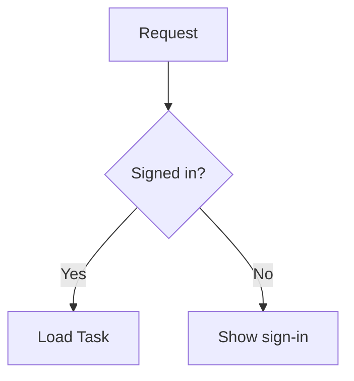

import { FeatureVideo } from "/snippets/feature-video.jsx";

<FeatureVideo src="https://assets.traycer.ai/docs/videos/mermaid-render.mp4" label="Open, zoom, pan, and export a Mermaid diagram" />

A `mermaid` code block in an artifact renders as an inline diagram. Use one when a flow, sequence, or relationship is easier to understand as a picture.

## Add a Diagram

Either:

- **Ask an agent.** For example: "Add a Mermaid sequence diagram of the sign-in flow to the tech plan." Agents are told to use Mermaid for flows and architecture.
- **Write one yourself.** In an artifact, type a code fence named `mermaid`, as you would in Markdown. After a short pause it turns into a diagram block. An empty block opens in the source editor with a starter diagram.

````markdown

````

If the source has an error, the block shows "Mermaid parse error" instead of the diagram.

## Block Controls

Hover a diagram to show its toolbar:

| Control                            | What it does                                                   |
| ---------------------------------- | -------------------------------------------------------------- |
| **Edit source** / **Close source** | Opens or closes the Mermaid source editor. Editors and Owners only. |
| **Copy code**                      | Copies the Mermaid source.                                     |
| **Download PNG**                   | Saves the diagram as an image.                                 |

The source editor saves as you type. Press ⌘Enter / Ctrl+Enter or Esc to close it; your changes are kept either way.

## Fullscreen

Click a diagram to open it fullscreen. The view has **Copy code**, **Download PNG**, and zoom controls: **Zoom out (-)**, **Zoom in (+)**, **Fit to screen (F)**, and **Actual size (0)**. The keys in the labels work while the zoom controls have focus.

- Drag to pan.
- Double-click to switch between fit to screen and actual size.
- On a trackpad, pinch to zoom and scroll to pan. The mouse wheel doesn't zoom.
- Press Esc to close.

## Diagrams Elsewhere

- The artifact's file on disk keeps the diagram as a `mermaid` code block. See [Artifacts on Disk](/panels/artifacts#artifacts-on-disk).
- A PDF export shows the diagram's source instead of the image. See [Export](/panels/artifacts/export).
